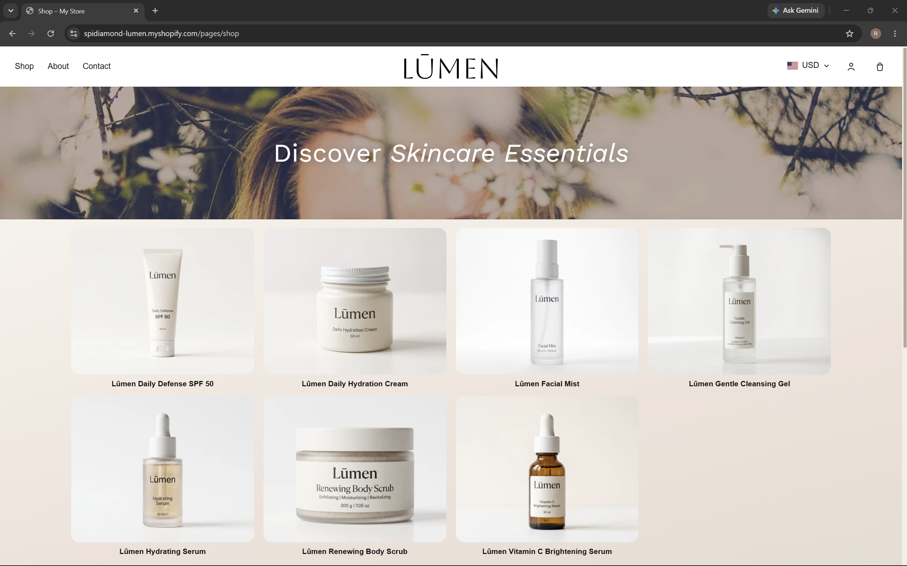
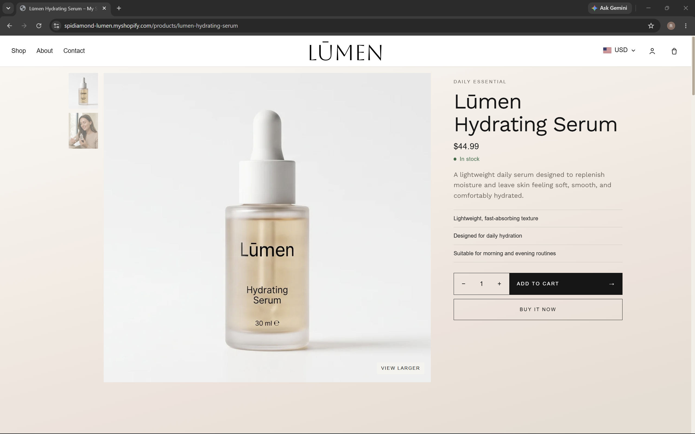
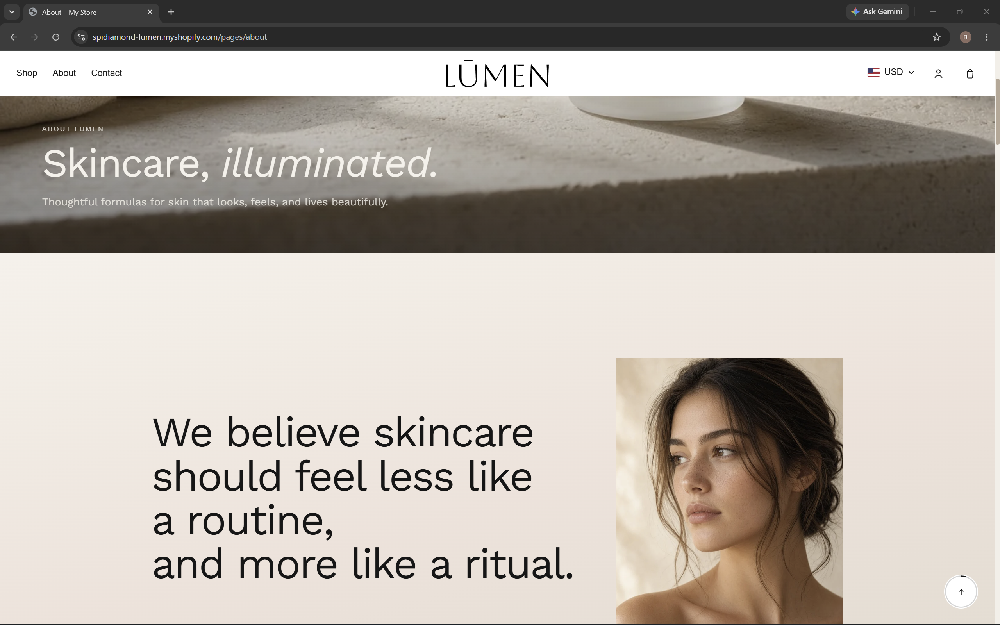
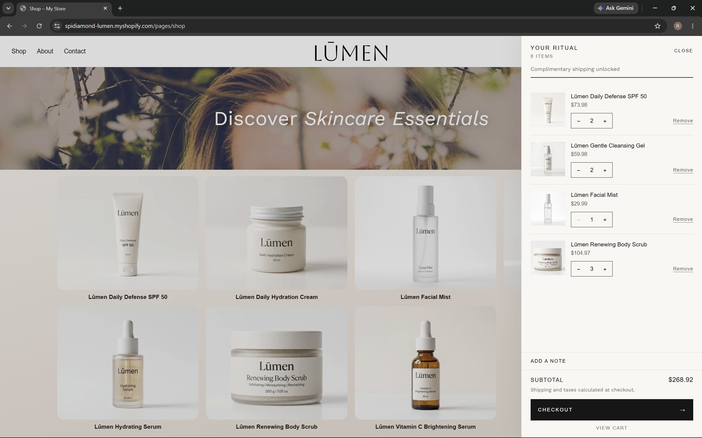
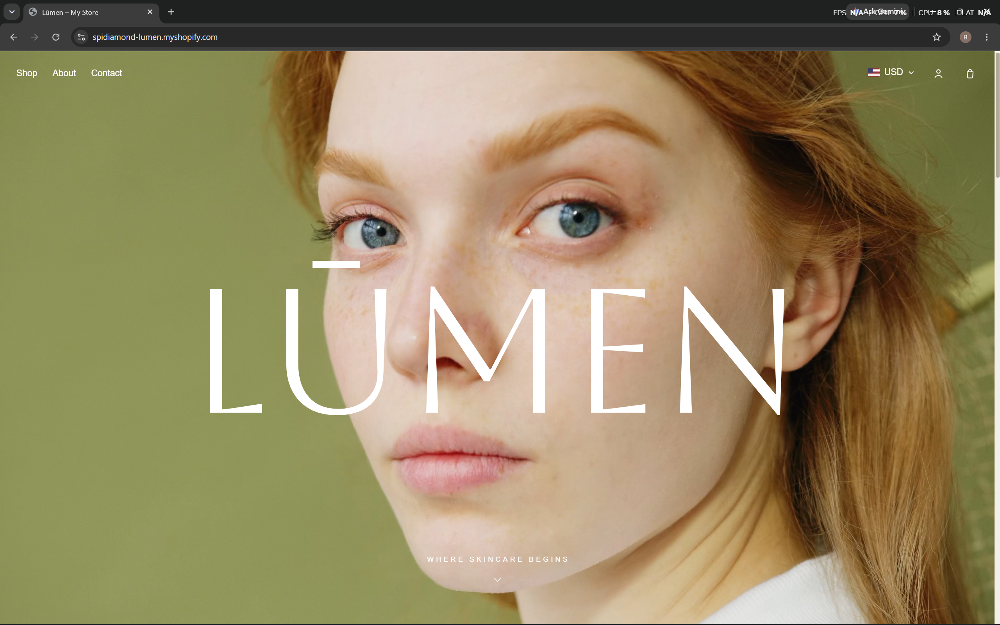
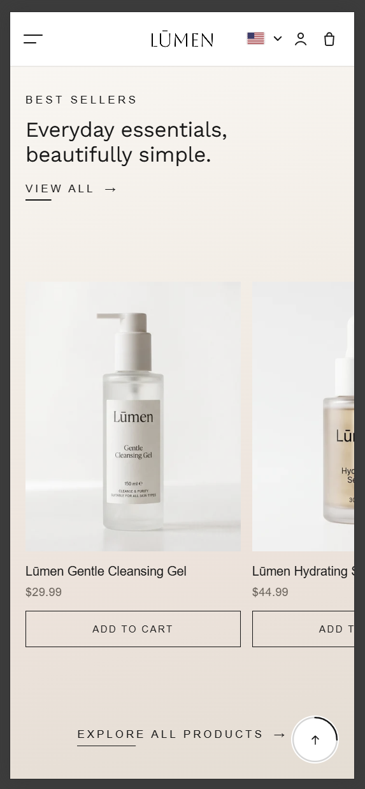

# Lūmen — Luxury Skincare Shopify Store

> A premium, editorial storefront for a modern skincare brand. Refined visual storytelling, quiet motion, and a shopping flow that stays out of the way.

<p align="center">
  
</p>

<p align="center">
  <a href="https://github.com/spidiamond/lumen"></a>
  <a href="./LICENSE.md"></a>
</p>

---

## Overview

**Lūmen** is a concept luxury skincare brand, built to show a high-end Shopify storefront that still feels easy to shop.

The store pairs a minimal editorial look with a complete purchase path: product discovery, a custom product page, an Ajax cart drawer, and pages for the brand and for getting in touch. It was designed and developed on Shopify’s native theme architecture, with custom Liquid, CSS, and JavaScript. No extra framework sits between the theme and the storefront.

---

## Preview

**Store:** [wgj454-ng.myshopify.com](https://wgj454-ng.myshopify.com)

**Source:** [github.com/spidiamond/lumen](https://github.com/spidiamond/lumen)

Preview the theme locally with the Shopify CLI:

```bash
git clone https://github.com/spidiamond/lumen.git
cd lumen
shopify theme dev
```

---

## The storefront

<p align="center">
  
  
</p>

<p align="center">
  
  
</p>

### Visual experience

- Editorial luxury skincare aesthetic
- Full-screen homepage hero
- Custom product hover interactions
- Smooth scrolling with a short, natural momentum nudge
- Subtle magnetic settling onto nearby sections
- Scroll-based reveal animations
- Before / after skin comparison slider
- Quiet microinteractions
- Responsive image treatment
- Custom back-to-top control with a scroll-progress ring

### Shopping

- Custom product grid
- Product image hover states
- Custom product pages
- Variant-aware product details
- Ajax add to cart
- Custom cart drawer
- Quantity controls and remove
- Empty cart state
- Cart count that stays in sync
- Layouts that hold together on small screens

### Pages

Home, Shop, Product, About, Contact, and Cart.

---

## Design direction

Lūmen stays restrained on purpose.

**Minimal.** Clean layouts and intentional space.

**Editorial.** Large imagery, careful type, and a clear hierarchy.

**Soft luxury.** Motion supports the page. It does not take it over.

**Easy to buy.** Product discovery, the product page, and checkout stay obvious.

The aim is a store that feels considered, and still simple to use.

---

## Tech stack

| Technology | Role |
| --- | --- |
| Shopify Liquid | Theme structure and store data |
| HTML | Semantic page structure |
| CSS | Layout, responsive design, and motion |
| JavaScript | Interaction and cart behavior |
| Shopify Ajax API | Cart updates without a full reload |
| Shopify theme architecture | Layout, templates, sections, and snippets |
| Shopify localization | Locale, routes, and money formatting |

The theme stays on Shopify’s own structure. There is no added application framework.

---

## Custom experience

### Smooth scrolling

Wheel scrolling keeps the browser’s native movement, then adds a very short momentum nudge. Trackpads and touch keep their own inertia. The page never takes over the scroll.

### Magnetic section settling

After scrolling has actually stopped, a nearby major section can ease into a cleaner resting position. Tall sections sit just below the header. Shorter ones are framed in the space that remains. If you stop between sections, the page stays where you left it.

### Product interactions

Product cards respond to a real pointer with a quiet image shift. Touch devices keep the product usable without a hover state.

### Before / after comparison

The homepage comparison is a slider. Dragging it compares the two images and does not trigger the page’s scroll settle.

### Cart drawer

Adding a product opens a confirmation, then **Your ritual**, a drawer on the right. From there a customer can review the cart, change quantities, remove a line, keep shopping, or go to checkout without leaving the page first.

---

## Performance and accessibility

### Performance

- Small, page-specific scripts
- Passive scroll listeners and a single animation loop
- Responsive Shopify image sizes
- Lazy loading below the fold
- Eager loading for the hero and the shop banner
- Motion built from transform and opacity where it matters

### Accessibility

- Semantic landmarks and headings
- Keyboard access for menus, the cart drawer, and currency controls
- Visible focus
- Labels on icon buttons
- Reduced-motion support
- Touch targets that stay usable on a phone
- Native Shopify contact and newsletter forms

---

## Responsive design

The composition is editorial on a large screen and stacks cleanly on a small one. Hover effects are limited to fine pointers. Touch uses tap.

### Desktop

<p align="center">
  
</p>

### Mobile

<p align="center">
  
</p>

Checked across phone, tablet, laptop, and wide desktop widths.

---

## Project structure

```text
├── assets/        Styles, scripts, and media
├── config/        Theme settings
├── layout/        Document wrappers
├── locales/       Theme translations
├── screenshots/   README previews
├── sections/      Page sections
├── snippets/      Shared Liquid
├── src/           Tailwind source for utilities.css
├── templates/     JSON page templates
└── README.md
```

---

## License

Released under the [MIT](./LICENSE.md) license.
